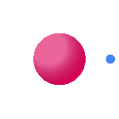

<h1 align="center">🎮 Huzaifa GameDev</h1>

<h3>Game Development | Interactive Entertainment | Classic Game Recreations</h3>

*A comprehensive collection of game development projects showcasing classic game mechanics, modern development practices, and interactive entertainment experiences built with LÖVE2D and other game engines.*

---

## 🚀 About This Organization

Welcome to my game development showcase! This organization represents my journey through game development, primarily focusing on classic arcade-style games and interactive entertainment. Each project demonstrates different aspects of game programming, from basic collision detection and physics to complex state management and procedural generation, emphasizing clean code architecture and engaging gameplay mechanics.

---

## 🛠️ Technologies & Game Engines

<h3 align="left">Game Engines & Frameworks:</h3>

  
  
  

<h3 align="left">Programming Languages:</h3>

  
  
  
  

<h3 align="left">Game Development Tools:</h3>

  
  

<h3 align="left">Graphics & Design:</h3>

 
  
  

---

## 📂 Featured Projects

### 🎾 **CS50 Pong**
> **Classic arcade game with AI opponent and smooth gameplay mechanics**
- **Features**: AI-controlled paddle, collision detection, score tracking, smooth ball physics
- **Tech Stack**: LÖVE2D, Lua, Game state management
- **Highlights**: Single-player mode, responsive controls, retro aesthetics
- **Course**: CS50's Introduction to Game Development
- [**🔗 View Repository**](https://github.com/huzaifa-gamedev/cs50-pong)

---

### 🐦 **CS50 Flappy Bird**
> **Side-scrolling endless runner with dynamic difficulty and medal system**
- **Features**: Randomized pipe gaps, medal rewards, pause functionality, procedural generation
- **Tech Stack**: LÖVE2D, Lua, Audio system integration
- **Highlights**: Dynamic spawn intervals, score-based progression, smooth animations
- **Course**: CS50's Introduction to Game Development
- [**🔗 View Repository**](https://github.com/huzaifa-gamedev/cs50-flappy-bird) | [**📺 YouTube Demo**](https://youtu.be/pcWGJrJZY4s?si=Tg-HKvmC7nclxmo9)

---

### 🧱 **CS50 Breakout**
> **Block-breaking game with power-ups and advanced paddle mechanics**
- **Features**: Multi-ball power-ups, paddle size mechanics, locked bricks system, key collection
- **Tech Stack**: LÖVE2D, Lua, Physics simulation, Power-up system
- **Highlights**: Dynamic paddle scaling, special brick types, balanced gameplay progression
- **Course**: CS50's Introduction to Game Development
- [**🔗 View Repository**](https://github.com/huzaifa-gamedev/cs50-breakout) | [**📺 YouTube Demo**](https://youtu.be/iXx1497JTpE?si=Prg1LnJX3ffYVyP2)

---

### 💎 **CS50 Match 3**
> **Puzzle game with special tiles and strategic matching mechanics**
- **Features**: Time bonuses, level progression, shiny tiles with row clearing, swap validation
- **Tech Stack**: LÖVE2D, Lua, Grid-based logic, Match detection algorithms
- **Highlights**: Dead board handling, variety-based scoring, cascade mechanics
- **Course**: CS50's Introduction to Game Development
- [**🔗 View Repository**](https://github.com/huzaifa-gamedev/cs50-match3) | [**📺 YouTube Demo**](https://youtu.be/KNoylyu6ESU?si=Ww6pjrrdy6sNmMmW)

---

### 🍄 **CS50 Super Mario Bros**
> **Platformer with progressive level system and key-lock mechanics**
- **Features**: Safe spawn system, colored keys and locks, goal post progression, infinite level generation
- **Tech Stack**: LÖVE2D, Lua, Tilemap generation, State persistence
- **Highlights**: Progressive difficulty, score persistence across levels, procedural level design
- **Course**: CS50's Introduction to Game Development
- [**🔗 View Repository**](https://github.com/huzaifa-gamedev/cs50-super-mario-bros) | [**📺 YouTube Demo**](https://youtu.be/z59Mh9Epx6U?si=R2Ov0DEHoSa9Ewo3)

---

## 📈 Game Development Categories & Skills Demonstrated

| **Category** | **Projects** | **Key Skills** |
|---|---|---|
| **🎯 Physics & Collision** | Pong, Breakout, Mario | Collision detection, Physics simulation, Movement mechanics |
| **🧩 Puzzle Mechanics** | Match 3, Breakout | Algorithm design, Grid logic, Pattern recognition |
| **🎮 Arcade Classics** | Pong, Flappy Bird | Game loop design, Score systems, Difficulty progression |
| **🏗️ Procedural Generation** | All projects | Level generation, Random spawning, Content variety |
| **🎨 Game States & UI** | Every project | Menu systems, Game state management, User feedback |
| **🔧 Game Architecture** | Larger projects | Code organization, Modular design, Extensible systems |

---

## 🌟 What Makes These Games Special

- ✅ **Classic Game Feel** - Authentic recreations with modern enhancements
- ✅ **Smooth Gameplay** - 60fps performance with responsive controls
- ✅ **Progressive Difficulty** - Balanced challenge curves and skill development
- ✅ **Clean Architecture** - Well-structured code with clear separation of concerns
- ✅ **Educational Value** - Each project demonstrates specific game development concepts
- ✅ **Enhanced Features** - Original improvements beyond basic requirements

---

# 🎓 Learning & Innovation

## Game Programming Mastery
**Core Systems Architecture** - Game loops, state management, entity-component systems, modular design patterns  
**Physics & Collision Systems** - Advanced collision detection, physics simulation, movement mechanics, spatial partitioning  
**Procedural Content Generation** - Level generation algorithms, random spawning systems, content variety techniques  
**Performance Optimization** - Frame rate optimization, memory management, efficient rendering, resource pooling  

## Game Design Excellence
**Gameplay Mechanics Design** - Balance systems, difficulty curves, progression mechanics, player engagement  
**User Experience in Games** - Input responsiveness, visual feedback, accessibility features, player onboarding  
**Audio Integration** - Sound design implementation, music systems, audio optimization, immersive soundscapes  
**Visual Design Patterns** - Sprite animation, particle effects, UI design, visual hierarchy in games  

## Advanced Game Development
**AI & Behavior Systems** - Game AI programming, decision trees, finite state machines, pathfinding algorithms  
**Multiplayer Architecture** - Network programming, client-server models, synchronization, lag compensation  
**Cross-Platform Development** - Engine-agnostic design, platform-specific optimizations, deployment strategies  
**Game Analytics** - Player behavior tracking, performance metrics, A/B testing in games, data-driven design  

## Innovation & Emerging Technologies
**Virtual & Augmented Reality** - Immersive game design, spatial computing, gesture-based interactions  
**Machine Learning in Games** - Procedural content with AI, adaptive difficulty systems, player behavior prediction  
**Cloud Gaming Technologies** - Streaming optimization, server-side rendering, distributed game systems  
**Experimental Gameplay** - Novel interaction methods, unconventional game mechanics, artistic expression through games

---

## 🤝 Collaboration & Learning

I'm passionate about game development and always eager to:

- **🔍 Code Reviews** - Share knowledge about game programming patterns
- **🚀 Open Source** - Contribute to game development community projects  
- **📚 Knowledge Sharing** - Write about game development best practices
- **🤝 Mentorship** - Help newcomers learn game programming fundamentals
- **💡 Game Jams** - Participate in rapid prototyping events
- **🎮 Indie Development** - Explore original game concepts and mechanics

---

## 📬 Let's Connect

**Professional Inquiries**: [karimhuzaifa590@gmail.com](mailto:karimhuzaifa590@gmail.com)  
**LinkedIn**: [Muhammad Huzaifa Karim](https://www.linkedin.com/in/muhammad-huzaifa-karim-590k)  
**Main Profile**: [@huzaifakarim1](https://github.com/huzaifakarim1)

---

### 🌟 Explore My Complete Development Journey

---

*Designing worlds that players can truly feel* 🌌

<!-- Footer -->

